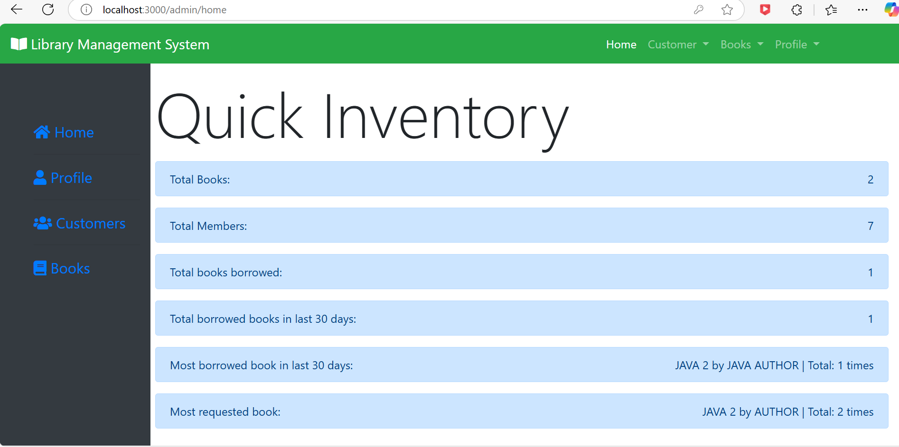

# Library Management System (LMS)

A Library Management System built using Node.js, MySQL, CSS, and Bootstrap. This system allows librarians to manage books, members, and transactions efficiently. It provides a user-friendly interface for adding, updating, deleting, and searching books, as well as managing member registrations and book borrow/return operations.

## Features
### Book Management:

Add, update, delete, and view books.

Search for books by title, author, or category.

### Member Management:

Add, update, delete, and view members.

Track member borrowing history.

### Transaction Management:

Borrow and return books.

Track due dates and fines (if applicable).

### User Authentication:

Secure login and registration for librarians.

### Responsive Design:

Built with Bootstrap for a mobile-friendly and responsive interface.

### Technologies Used
Backend: Node.js, Express.js

Database: MySQL

Frontend: HTML, CSS, Bootstrap

Authentication: Passport.js 

### Other Tools: NPM, Git

### Prerequisites
Before running the project, ensure you have the following installed:

Node.js: Download and Install Node.js

MySQL: Download and Install MySQL

Git: Download and Install Git

### Installation
Follow these steps to set up the project locally:

Clone the Repository:

```bash
Copy
git clone https://github.com/Trtheo/LMS-in-Node.js_Mysql_CSS.git
cd LMS-in-Node.js_Mysql_CSS
Install Dependencies:

Copy
npm install
Set Up the Database:

Create a MySQL database named  library_management_system

Import the database schema from library_management_system.sql


In models/config.js

Make sure that Database Connection Looks like This: 
DB_HOST=localhost
DB_USER=root
DB_PASSWORD=your_mysql_password
DB_NAME=library_management_system


Run the Application:


npm start
Access the Application:

Open your browser and go to http://localhost:3000.

Project Structure

LMS-in-Node.js_Mysql_CSS/
├── controllers/          # Logic for handling routes
├── models/               # Database models and queries
├── views/                # EJS templates for rendering pages
├── public/               # Static files (CSS, JS, images)
│   ├── css/
│   ├── js/
│   └── images/
├── routes/               # Express routes
├── database/             # Database schema and scripts
├── .env                  # Environment variables
├── app.js                # Main application file
├── package.json          # NPM dependencies and scripts
└── README.md             # Project documentation
```

### Usage
#### Librarian Login:

Use the default admin credentials or register a new librarian.

##### Default Admin:

Email: admin10@gmail.com

Password: Admin_10

#### Manage Books:

Add new books with details like title, author, category, and ISBN.

Update or delete existing books.

#### Manage Members:

Register new members with details like name, email, and phone number.

Update or delete member records.

#### Transactions:

Borrow books for members and track due dates.

Return books and calculate fines (if applicable).


#### Acknowledgments
Bootstrap for the responsive design.

Node.js and Express.js for the backend.

MySQL for the database.

#### Contact
For any questions or feedback, feel free to reach out:

Theophile GitHub profile: https://github.com/Trtheo

Email: niyigabatheo10@gmail.com

Enjoy using the Library Management System! 

#### Follow me on GitHub    https://github.com/Trtheo